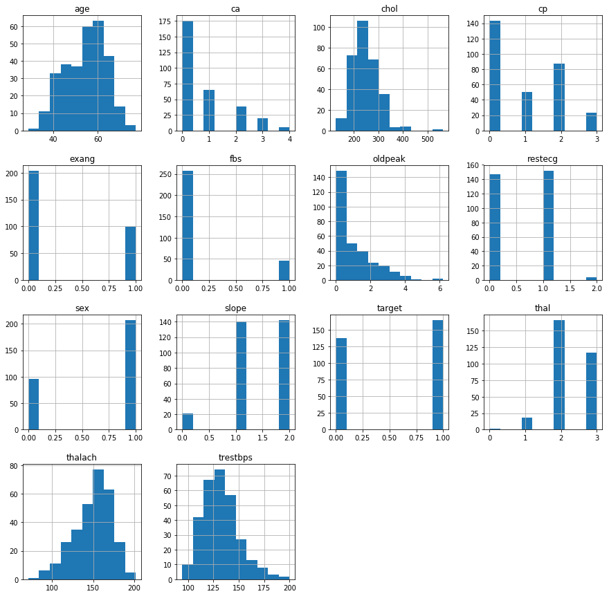
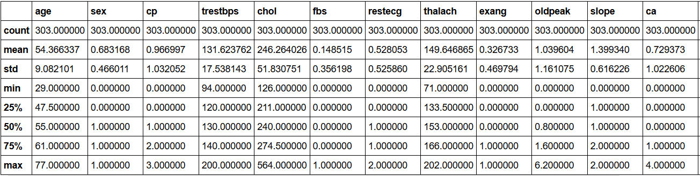
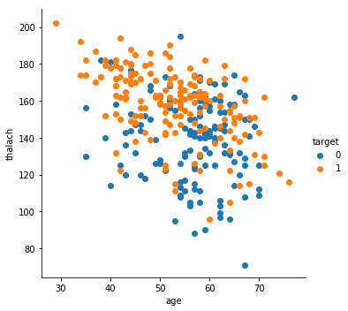
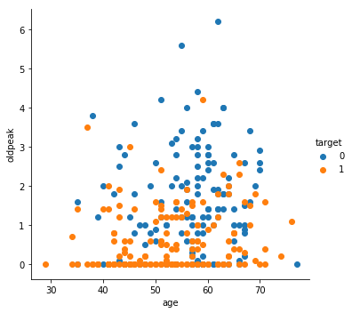
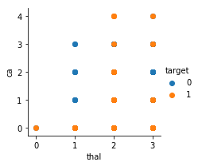
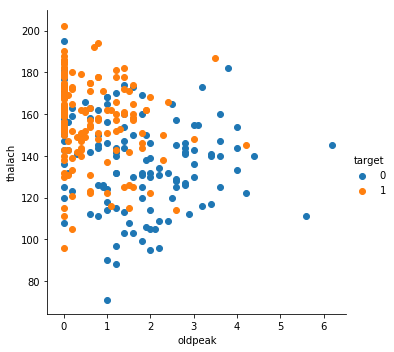
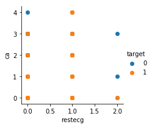
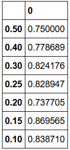

# Heart Disease Prediction using AdaBoost & RandomForest

**Author**: SHAILESH DHAMA

### Business problem:

To predict heart disease using Classification methods.

### Dataset : https://www.kaggle.com/ronitf/heart-disease-uci

### REQUIRED LIBRARIES :

    1.Numpy
    2.Pandas
    3.Seaborn
    4.Math
    5.Matplotlib

## STEPS :

    - Data preprocessing and cleaning
    - Data Visualisation
    - Random Forest Classification
    - AdaBoost Classification
    - Accuracy with different test sizes.

## RESULTS :

#### Data Visualisation

> Histographs of Data Attributes


> Data Description

#### Random Forest Classification






> Random Forest FacetGrid Plots

#### AdaBoost Classification


> Accuracy of AdaBoost Modelling.

### For further information

Please review the narrative of our analysis in [our jupyter notebook](./heart-disease-prediction-using-adabooost.ipynb)

For any additional questions, please contact **shaileshshettyd@gmail.com)

##### Repository Structure:

```
├── README.md                                       <- The top-level README for reviewers of this project.
├── heart-disease-prediction-using-adabooost.ipynb  <- narrative documentation of analysis in jupyter notebook
└── images                                          <- both sourced externally and generated from code
```
